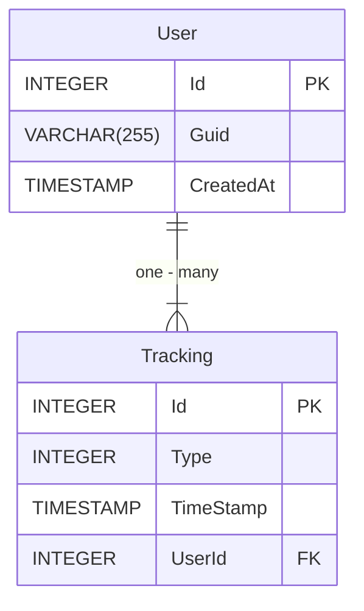

```mermaid
erDiagram
	User {
		INTEGER Id PK
		VARCHAR(255) Guid
		TIMESTAMP CreatedAt
	}

	Tracking {
		INTEGER Id PK
		INTEGER Type
		TIMESTAMP TimeStamp
		INTEGER UserId FK
	}

	User ||--|{ Tracking : "one - many"
```